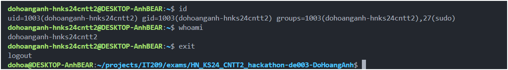
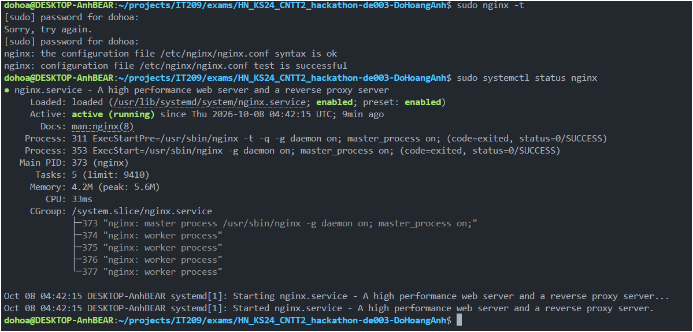
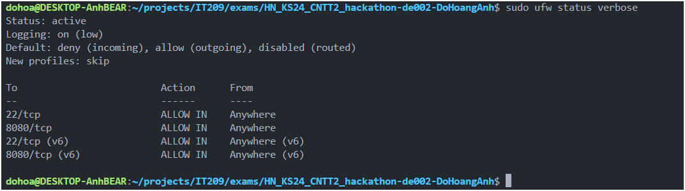

# DevOps Hackathon – Đề 003: Quản lý công việc (Task)

## 1. Thông tin sinh viên

| Họ và tên    | Mã sinh viên | Lớp           | Tài khoản Linux        | GitHub   | Cổng Nginx |
| ------------ | ------------ | ------------- | ---------------------- | -------- | ---------- |
| Đỗ Hoàng Anh | PTIT-HN-031  | HN-KS24-CNTT2 | dohoanganh-hnks24cntt2 | Anhdozxc | 8080       |

## 2. Môi trường triển khai

- Hệ điều hành: Ubuntu 24.04 (WSL2 có bật systemd)
- Nginx: 1.24.0 (phiên bản qua apt)
- Git: 2.43.0
- Nơi chạy: WSL2 cục bộ

## 3. Cấu trúc dự án

```text
.
├── src/
│   └── index.html
├── nginx/
│   └── dohoanganh-hnks24cntt2.conf
├── screenshots/
│
├── .gitignore
└── README.md
```

## 4. Cấu hình Nginx

| Tham số trong template | Giá trị đã điền                                | Giải thích                                                            |
| ---------------------- | ---------------------------------------------- | --------------------------------------------------------------------- |
| `<PORT>`               | 8080                                           | Cổng cá nhân phục vụ web thay cho cổng 80 mặc định                    |
| `<SERVER_NAME>`        | 192.168.203.225                                | Địa chỉ IP của máy chủ lấy từ lệnh `hostname -I`                      |
| `<WEB_ROOT>`           | /var/www/devops-hackathon-de003-dohoanganh/src | Đường dẫn tuyệt đối đến thư mục chứa mã nguồn web                     |
| `<INDEX_FILE>`         | index.html                                     | File mặc định Nginx sẽ hiển thị khi truy cập web root                 |
| `<TEN_TAI_KHOAN>`      | dohoanganh-hnks24cntt2                         | Tên tài khoản để lưu file access/error log tương ứng                  |
| `<ALLOW_DIRECTIVE>`    | allow all                                      | Chỉ thị Nginx cho phép mọi truy cập (tương đương Require all granted) |

## 5. Tường lửa UFW

Đã thực hiện mở port 22 cho SSH và 8080 cho Nginx:

- `sudo ufw allow 22/tcp`
- `sudo ufw allow 8080/tcp`
  Kết quả `sudo ufw status verbose`:

```
Status: active
Logging: on (low)
Default: deny (incoming), allow (outgoing), disabled (routed)
New profiles: skip

To                         Action      From
--                         ------      ----
22/tcp                     ALLOW IN    Anywhere
8080/tcp                   ALLOW IN    Anywhere
22/tcp (v6)                ALLOW IN    Anywhere (v6)
8080/tcp (v6)              ALLOW IN    Anywhere (v6)
```

## 6. Các bước triển khai

- Thêm `systemd=true` vào `/etc/wsl.conf`
- Khởi tạo người dùng: `sudo useradd -m -s /bin/bash -U -G sudo -c "Do Hoang Anh" dohoanganh-hnks24cntt2`
- Đặt mật khẩu: `echo "dohoanganh-hnks24cntt2:123456" | sudo chpasswd`
- Cấp quyền NOPASSWD: `echo "dohoanganh-hnks24cntt2 ALL=(ALL) NOPASSWD: ALL" | sudo tee /etc/sudoers.d/dohoanganh-hnks24cntt2`
- Cài đặt Nginx, Git, UFW, curl: `sudo apt update && sudo apt install -y nginx git ufw curl`
- Đẩy source code lên github và git clone về `/var/www/devops-hackathon-de003-dohoanganh/`
- Phân quyền thư mục: `sudo chown -R dohoanganh-hnks24cntt2:dohoanganh-hnks24cntt2 /var/www/devops-hackathon-de003-dohoanganh`
- Thiết lập quyền 755 và 644
- Kích hoạt Nginx site, reload dịch vụ Nginx
- Kích hoạt UFW và cho phép cổng 8080

## 7. Kiểm tra & minh chứng






## 8. Quy trình cập nhật website

- Chỉnh sửa thêm thẻ thông báo cập nhật vào file `src/index.html` tại local máy cá nhân.
- Tạo commit mới "feat(update): cập nhật lần 2 cho trang index.html" và đẩy lên Github.
- SSH vào server, điều hướng tới `/var/www/devops-hackathon-de003-dohoanganh/` và dùng lệnh `git pull` để tải về mã nguồn mới mà không cần reload Nginx.
  

## 9. Sự cố gặp phải & cách khắc phục (nếu có)

- Không gặp sự cố đáng kể nào trong quá trình triển khai.
